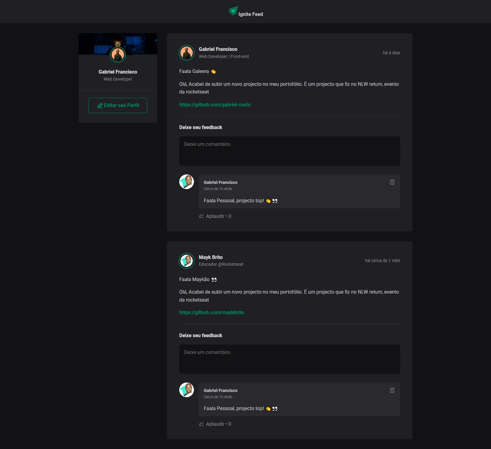

# Ignite Feed

Feed application developed in the module: ReactJS Fundamentals.

Ignite feed is a project that simulates the social media feed, with features such as comments, applause and deletion of comments.

developed during the training at https://www.rocketseat.com.br of the react fundamentals module, with the objective of establishing the pillars of react, which are componentization, properties, states and development of static typing with typescript.

## 🛠️ Tecnologies

<ul>
  <li>Vite</li>
  <li>React.js</li>
  <li>Typescript</li>
</ul>

## 🚀 How to start ?

install node.js on your computer

1. Clon repository
> git clone https://github.com/usuario/nome-do-projeto.git

2. Browse to project folder 
> cd project-name

3. Install dependencies 
> npm install

4. Execute the project 
> npm run dev 

## 📚 Functional requirements

<li>
  1 - Create comments 
</li>
<li>
  2 - Delete comments 
</li>
<li>
  3 - Add likes in comments 
</li>
